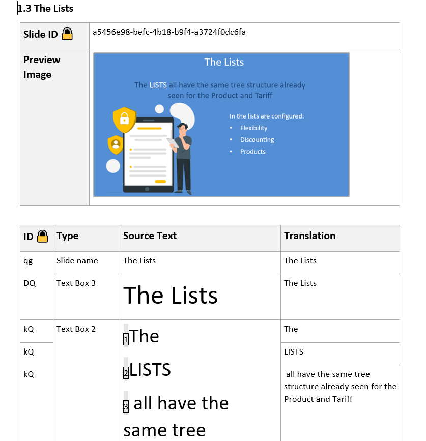
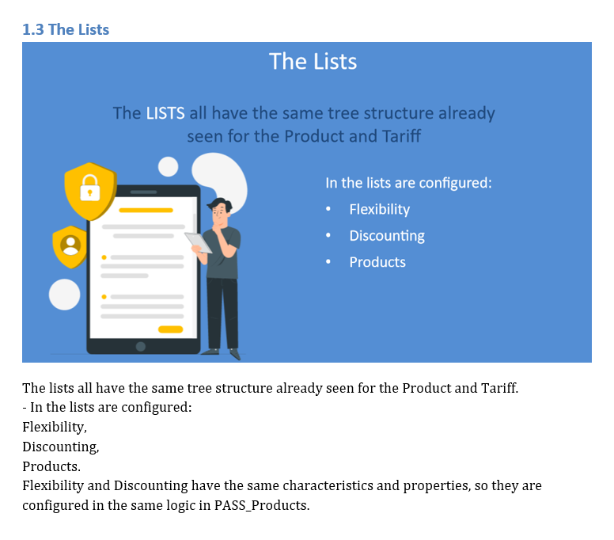
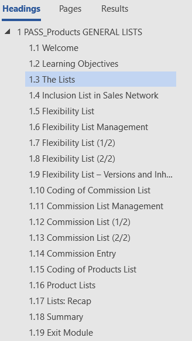

# Academy word document conversion tool
Tool to convert the documents used by the RGI Acedemy to produce the interactive courses to a slide notes format.

Run the tool following the [instuctions](./README_run.md)

Test the tool via Pytest.

## Result achieved

Slides described in a tabular format like this

are converted into this format

The table of content remains unchanged

## Conversion logic
### Slides
A slide is identified by a table whose first cell in the first row has "ID 🔒".

The slide notes content is taken from the third cell of the row whose second cell has the value "Slide Notes". If the table does not have a row whose second value is "Slide Notes", then the content is the concatenation of the third cells of all other rows.

### Paragraphs and Headings
Paragraphs whose style is either "Heading 1" or "Titolo 11" are considered top paragraphs which refer to a group of slides and not a specific slides.

Paragraphs which have a different style are considered to refer to a specific slide and their content becomes the title of the slide.

### Images
Images are extracted by zipping the word document and then extracting all files contained in the "word/media/" folder in the zip file.
